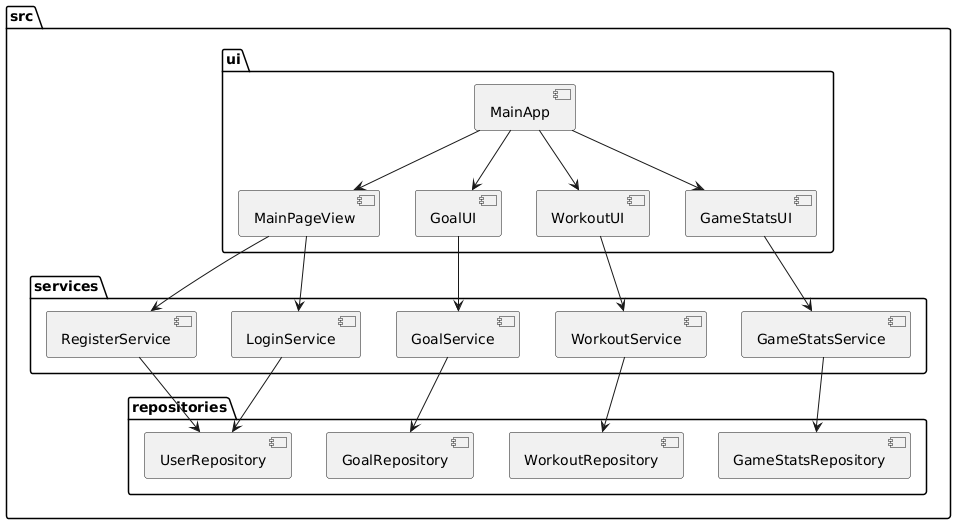
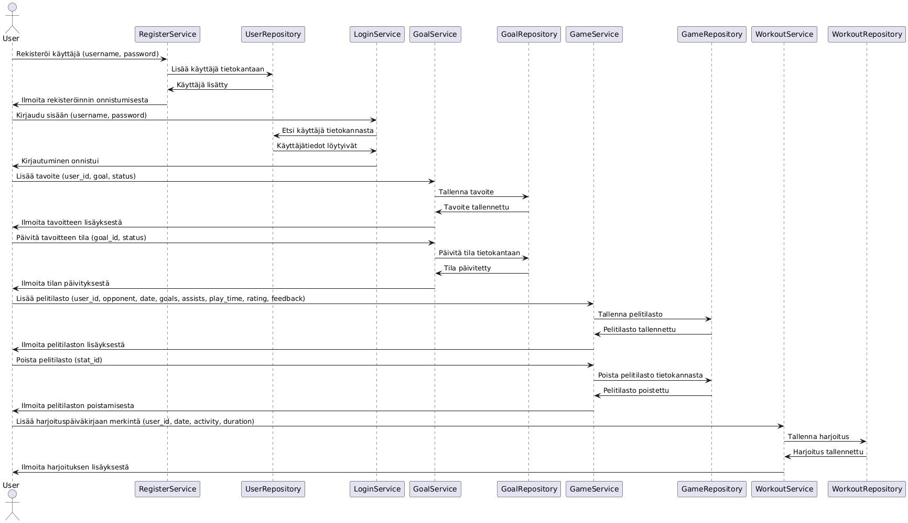

# Arkkitehtuurikuvaus

## Sovelluksen rakenne

Sovellus noudattaa monikerroksista arkkitehtuurimallia, jossa logiikka on jaettu seuraaviin pääkerroksiin:

## Käyttöliittymäkerros (UI):

Hakemistossa src/ui sijaitsevat kaikki sovelluksen käyttöliittymäkomponentit.
Jokaiselle päätoiminnallisuudelle on oma näkymänsä (esim. GoalUI ja LoginUI).
Käyttöliittymä hoitaa käyttäjän syötteiden vastaanoton ja esittää tiedot visuaalisesti.

## Sovelluslogiikka (services):

Hakemisto src/services sisältää sovelluksen keskeisen liiketoimintalogiikan.
Esimerkiksi luokat LoginService ja GoalService käsittelevät kirjautumiseen ja tavoitteiden hallintaan liittyvät toiminnot.
Palvelut toimivat käyttöliittymän ja tietovarastokerroksen välisenä liimana.

## Tietokannan rajapinta (repositories):

Hakemistossa src/repositories sijaitsevat tietokantatoiminnot.
Luokat, kuten UserRepository ja GoalRepository, hoitavat tietokannan kyselyt ja päivitykset.

## Yhteiset resurssit ja tietokanta:

Juurihakemistossa sijaitsee tietokannan alustamiseen liittyvä koodi. Sovellus käyttää SQLite-tietokantaa tiedon tallentamiseen.
build.py-skripti vastaa tietokannan rakenteen luomisesta ja alustamisesta.

## Sovelluksen käynnistys:

Pääsovelluksen käynnistyspiste (index.py) yhdistää käyttöliittymän ja taustalogiikan.

# Sovelluslogiikka

## Tavoitteiden hallinta

Käyttäjä lisää tavoitteen: Käyttöliittymä lähettää tavoitteen GoalService-luokalle, joka tarkistaa syötteen validiteetin ja kutsuu GoalRepository-luokan metodia tietokantapäivitystä varten.
Tavoitteen tilan päivittäminen: Käyttäjä valitsee tavoitteen ja uuden tilan, ja GoalService varmistaa tilan oikeellisuuden ennen päivittämistä.

## Harjoituspäiväkirjan hallinta

Harjoituspäiväkirjan lisääminen: WorkoutService vastaa käyttäjän päivittäisten harjoitusten kirjaamisesta, tallentamalla merkinnät WorkoutRepository-luokan kautta.
Päiväkirjan näyttäminen: Käyttöliittymä hakee merkinnät WorkoutService-luokalta ja esittää ne käyttäjälle.

## Pelitilastot

Pelitilastojen kirjaaminen: GameStatsService vastaa pelitilastojen tallentamisesta, kuten pelin aikaleima, joukkueet ja pistemäärät.
Vastustajat haetaan data/teams.txt tiedostosta.

Pelitilastojen tarkastelu: Käyttäjä voi tarkastella pelitilastoja, jotka haetaan GameStatsRepository-luokalta ja esitetään käyttöliittymässä.
Pelitilastojen poistaminen: Käyttäjä voi poistaa valitsemiaan pelitilastoja tietokannasta.

## Käyttäjän hallinta

Kirjautuminen: LoginService tarkistaa syötetyn käyttäjänimen ja salasanan UserRepository-luokkaa hyödyntäen.
Uloskirjautuminen: Sovellus tyhjentää aktiivisen käyttäjän tiedot muistista.

## Rekisteröinnin hallinta

Rekisteröinti: RegisterService huolehtii käyttäjätunnusten luomisesta ehtojen mukaisesti, kuten uniikki käyttäjätunnus ja riittävän pitkä salasana.
RegisterService hyödyntää UserRepository-luokkaa.
