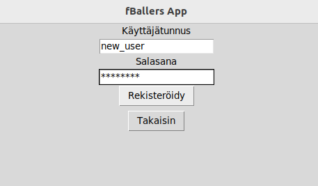
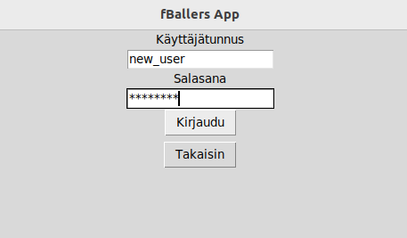
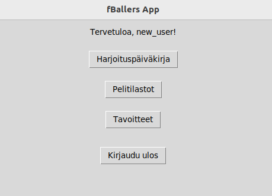
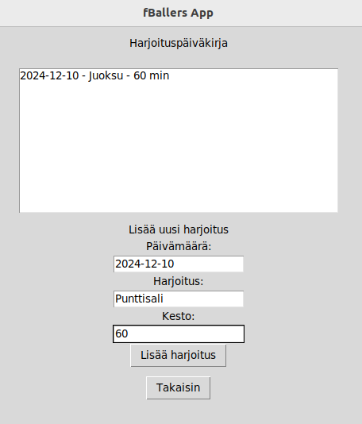
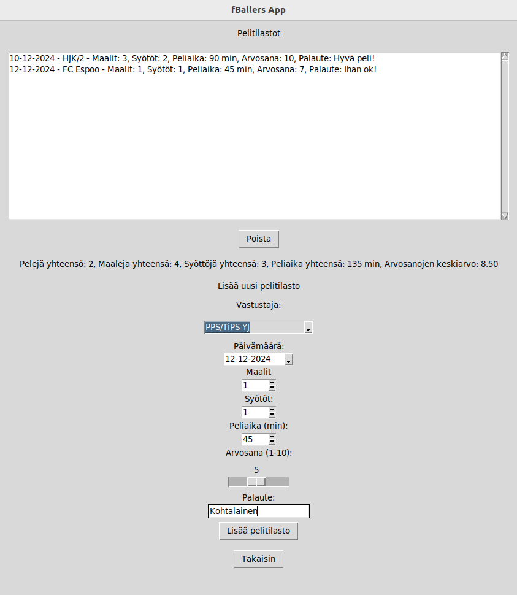
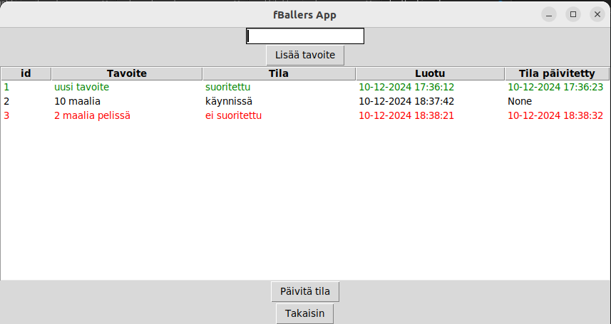

# Käyttöohje

Lataa projektin uusin [release](https://github.com/F4U57O/ot-harjoitustyo/releases/tag/viikko6) valitsemalla "Source code" joko .zip tai .tar.gz
Pura tiedosto haluamaasi hakemistoon.

## Ennen sovelluksen käynnistämistä

Asenna riippuvuudet komennolla:

```bash
poetry install
```

Sekä alustustoimenpiteet komennolla:

```bash
poetry run invoke build
```

## Sovelluksen käynnistäminen

Käynnistä sovellus komennolla:

```bash
poetry run invoke start
```

## Rekisteröityminen

Sovelluksen etusivulta paina "Rekisteröidy"-nappia, josta pääset seuraavaan:




## Kirjautuminen

"Kirjaudu"-napista pääset kirjautumaan tunnuksillasi:



## Etusivu

Etusivun näkymässä on vaihtoehtoina "Harjoituspäiväkirja", "Pelitilastot" ja "Tavoitteet"



## Harjoituspäiväkirja

Voit luoda omia harjoituspäiväkirja merkintöjä:



Täytä kentät ja paina "Lisää harjoitus"

## Pelitilastot

Voit luoda ja poistaa pelitilastoja:



Täytä tilastokentät ja paina "Lisää pelitilasto". Tilastoja voi poistaa
valitsemalla tilaston ja painamalla "Poista"

## Tavoitteet

Voit luoda tavoitteita ja päivittää niiden tiloja:



Täytä kentät ja paina "Lisää tavoite".
Klikkaamalla tavoitetta voit päivittää sen tilan "käynnissä", "suoritettu" ja
"ei suoritettu" valinnan jälkeen paina "Päivitä tila"
