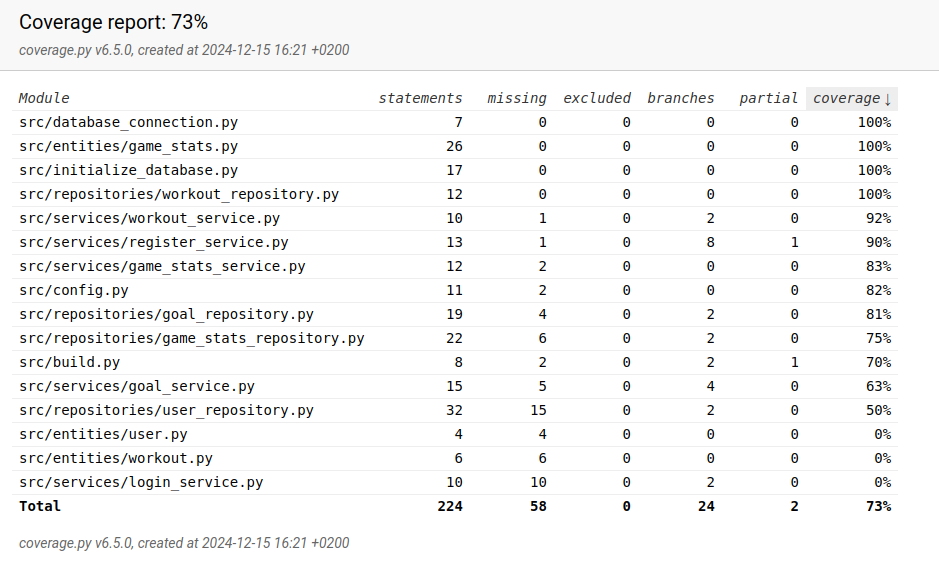

# Testausdokumentti

Sovellus on testattu automatisoitujen yksikkö-ja integraatiotestien avulla käyttäen
unittest-moduulia sekä järjestelmätason testauksella, joka on toteutettu manuaalisesti.

## Yksikkö- ja integraatiotestaus

Ohjelman sovelluslogiikkaa testataan seuraavilla testiluokilla ja -menetelmillä:

* GameStatsService:
  - TestGameStats-luokka testaa pelitilastojen hallinasta vastaavan GameStatsService-luokan
    toimintaa. Palveluluokka alustetaan siten, että sille annetaan riippuvuudeksi GameStatsRepository.
  - Testeissä tarkistetaan seuraavat:
    - Uuden pelitilaston lisääminen onnistuu oikeilla tiedoilla.
    - Virheelliset tiedot, kuten puuttuva tai epäkelpo data, palauttavat oikean  virheilmoituksen.
    - Tiedot tallentuvat ja haetaan oikein tietokannasta.

* GoalService:
  - TestGoal-luokka testaa tavoitteiden hallinasta vastaavaa GoalService-luokkaa.
  - Testeissä tarkistetaan seuraavat:
    - Uuden tavoitteen lisääminen toimii oikeilla tiedoilla.
    - Liian lyhyet tavoitteet hylätään ja palautetaan selkeä virheilmoitus.

* RegisterService:
  - TestRegister-luokka testaa käyttäjän rekisteröinnistä vastaavan RegisterService-luokan toimintaa.
  - Testeissä tarkistetaan seuraavat:
    - Rekisteröinti onnistuu oikeilla tiedoilla.
    - Liian lyhyt käyttäjänimi tai salasana palauttaa virheen.
    - Käyttäjätunnuksen yksilöllisyys tarkistetaan ja käytössä olevat käyttäjätunnukset hylätään selkeällä virheilmoituksella.

* WorkoutService:
  - TestWorkout-luokka testaa harjoitusten hallinnasta vastaavaa WorkoutService-luokkaa.
  - Testeissä tarkistetaan seuraavat:
    - Harjoitusten lisääminen onnistuu oikeilla tiedoilla.
    - Tyhjä tai epäkelvot arvot aiheuttavat virheilmoituksen.

## Repositorio-luokat

Kaikki repositorio-luokat testataan käyttäen erillistä testitietokantaa, joka alustetaan jokaisen testisession aikana:

* GameStatsRepository, GoalRepository, UserRepository ja WorkoutRepository testataan erillisillä testiluokilla, joissa:
  - Varmistetaan, että tietokantaan lisätyt tiedot tallentuvat oikein.
  - Tietokannasta haetut tiedot vastaavat tallennettuja.
  - Virheelliset syötteet käsitellään turvallisesti ja aiheuttavat oikeat poikkeukset.

Testitietokannan konfigurointi on määritelty erillisessä .env.test-tiedostossa, ja testit suoritetaan testikäyttöön tarkoitettua SQLite-tietokantaa.

## Järjestelmätason testaus

Sovelluksen järjestelmätason testaus on suoritettu manuaalisesti.
Seuraavat testit on suoritettu:

* Asennus ja konfigurointi
  - Sovellus on asennettu ja konfiguroitu käyttöohjeen mukaisesti Windows- ja Linux-ympäristöön.

* Päätoiminnallisuudet:
  - Kaikki määrittelydokumentissa ja käyttöohjeessa listatut toiminnallisuudet on testattu.
  - Testauksissa on testattu onnistuneet ja epäonnistuneet käyttötapaukset sekä niiden ilmoitukset.

## Testikattavuus

Testien haaraumakattavuus on 73% ilman käyttöliittymäkerrosta:

