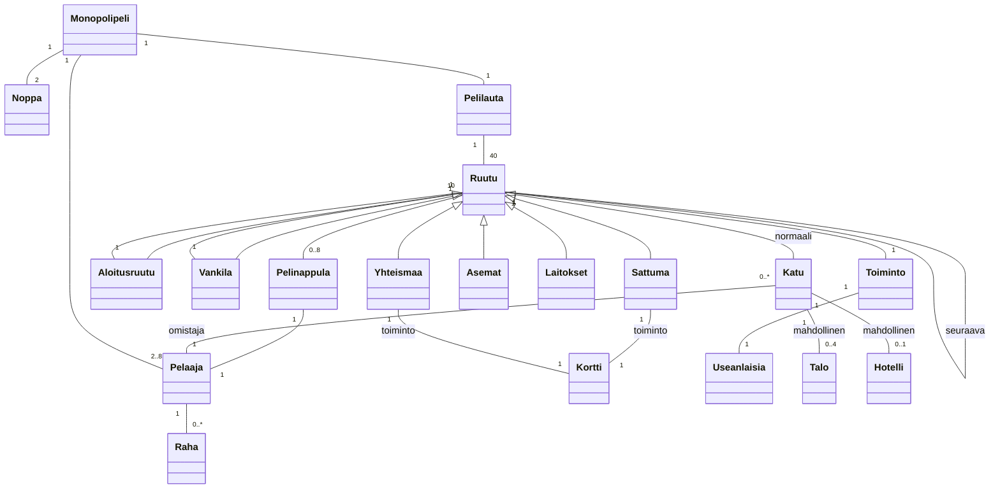

```mermaid
 classDiagram
    Monopolipeli "1" -- "2" Noppa
    Monopolipeli "1" -- "1" Pelilauta
    Pelilauta "1" -- "40" Ruutu
    Ruutu "1" -- "1" Ruutu : seuraava
    Ruutu "1" -- "0..8" Pelinappula
    Pelinappula "1" -- "1" Pelaaja
    Pelaaja "2..8" -- "1" Monopolipeli
    Ruutu <|-- Aloitusruutu
    Ruutu <|-- Vankila
    Ruutu <|-- Sattuma
    Ruutu <|-- Yhteismaa
    Ruutu <|-- Asemat
    Ruutu <|-- Laitokset
    Ruutu <|-- Katu : normaali
    Ruutu "1" -- "1" Aloitusruutu
    Ruutu "10" -- "1" Vankila
    Ruutu "1" -- "1" Toiminto
    Sattuma "1" -- "1" Kortti: toiminto
    Yhteismaa "1" -- "1" Kortti: toiminto
    Toiminto "1" -- "1" Useanlaisia
    Katu "1" -- "0..4" Talo : mahdollinen
    Katu "1" -- "0..1" Hotelli : mahdollinen
    Katu "0..*" -- "1" Pelaaja : omistaja
    Pelaaja "1" -- "0..*" Raha


```
