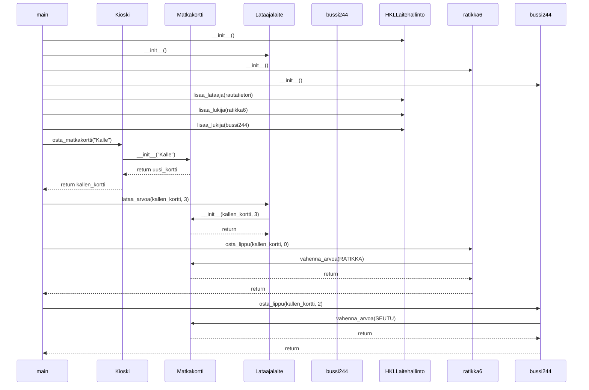

```mermaid
sequenceDiagram
  participant main
  participant Kioski
  participant Matkakortti
  participant Lataajalaite
  participant Lukijalaite as ratikka6
  participant Lukijalaite as bussi244
  participant HKLLaitehallinto

  main ->> HKLLaitehallinto: __init__()
  main ->> Lataajalaite: __init__()
  main ->> ratikka6: __init__()
  main ->> bussi244: __init__()
  main ->> HKLLaitehallinto: lisaa_lataaja(rautatietori)
  main ->> HKLLaitehallinto: lisaa_lukija(ratikka6)
  main ->> HKLLaitehallinto: lisaa_lukija(bussi244)

  main ->> Kioski: osta_matkakortti("Kalle")
  Kioski ->> Matkakortti: __init__("Kalle")
  Matkakortti -->> Kioski: return uusi_kortti
  Kioski -->> main: return kallen_kortti

  main ->> Lataajalaite: lataa_arvoa(kallen_kortti, 3)
  Lataajalaite ->> Matkakortti: __init__(kallen_kortti, 3)
  Matkakortti -->> Lataajalaite: return

  main ->> ratikka6: osta_lippu(kallen_kortti, 0)
  ratikka6 ->> Matkakortti: vahenna_arvoa(RATIKKA)
  Matkakortti -->> ratikka6: return
  ratikka6 -->> main: return

  main ->> bussi244: osta_lippu(kallen_kortti, 2)
  bussi244 ->> Matkakortti: vahenna_arvoa(SEUTU)
  Matkakortti -->> bussi244: return
  bussi244 -->> main: return

```
